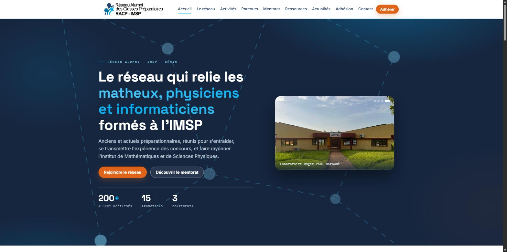

# Site RACP-IMSP — Réseau Alumni des Classes Préparatoires de l'IMSP

Site web du réseau alumni de l'IMSP (Bénin) : vitrine, programme de mentorat
(présentation + formulaires de candidature parrain/marraine et filleul·e), bibliothèque
de ressources et pages légales.

**HTML / CSS / JavaScript statique** — aucun build, aucune dépendance à installer.
Déployable **tel quel** sur GitHub Pages, Netlify, Vercel ou tout hébergeur de fichiers.

> 🌐 **Site en ligne** — _à renseigner au déploiement_ (prévu : https://racp-imsp.org).

<<<<<<< HEAD

=======
> **Sécurité.** Le durcissement appliqué (CSP, anti-XSS de l'espace coordinateur,
> honeypot des formulaires, en-têtes serveur) est documenté dans **docs/SECURITE.md**.
>>>>>>> 4deba6d7825e93572eb83fb1df5b276af63ab0d7

**Sections du site :** Accueil · Le réseau · Activités · Parcours · Mentorat ·
Ressources (bibliothèque filtrable) · Actualités · Adhésion · Contact — plus un espace
coordinateur (`admin/`, phase 2).

<<<<<<< HEAD
## Lancer en local
=======
```
site/
├── index.html              Accueil
├── reseau.html             Mission & gouvernance
├── activites.html          Activités
├── mentorat.html           Le programme de mentorat (présentation)
├── devenir-parrain.html    Candidature mentor (formulaire multi-étapes)
├── devenir-filleul.html    Demande d'accompagnement (formulaire multi-étapes)
├── ressources.html         Bibliothèque en ligne (documents + vidéos, filtrable)
├── actualites.html         Actualités / événements + inscription newsletter
├── adhesion.html           Adhésion (vers le Google Form)
├── contact.html            Contact
├── confidentialite.html    Politique de confidentialité (RGPD)
├── mentions-legales.html   Mentions légales
├── styles.css              Identité visuelle (couleurs exactes du logo)
├── script.js               Navigation, animations, formulaires, newsletter
├── manifest.json           Manifest PWA (icône mobile, theme-color)
├── sitemap.xml             Plan du site (SEO)
├── robots.txt              Indexation (SEO)
├── .nojekyll               Pour GitHub Pages
├── LICENSE / .gitignore    Licence + fichiers de dépôt
├── docs/                   Documentation interne (CHECKLIST, SECURITE, CORRECTIONS, schéma Supabase, Matières…)
├── 404.html
├── newsletter/
│   └── template-newsletter.html   Gabarit e-mail réutilisable
└── assets/
    ├── logo-racp.png       Logo couleur (transparent)
    ├── logo-racp-white.png Logo blanc (pied de page sombre, e-mail)
    ├── favicon.png         Icône (les deux silhouettes) — onglet + en-tête
    ├── og-image.jpg        Image de partage (réseaux sociaux)
    ├── logo-imsp.jpg       Logo de l'Institut (IMSP)
    ├── img/                Photos du campus (optimisées) + arrière-plans floutés
    └── docs/               Statuts & règlement (PDF)
```
>>>>>>> 4deba6d7825e93572eb83fb1df5b276af63ab0d7

Servez le dossier avec un petit serveur (l'ouverture directe du `.html` bloque certaines
fonctions comme l'envoi des formulaires) :

```bash
python -m http.server 8000
# puis ouvrez http://localhost:8000
```

## Déployer

Le site se déploie **tel quel** (les fichiers sont à la racine) :

- **GitHub Pages** — Settings → Pages → branche `main`, dossier `/ (root)`. Le fichier
  `.nojekyll` est déjà présent.
- **Netlify / Vercel / Cloudflare Pages** — glisser-déposer le dossier, ou connecter le dépôt.

Après déploiement, renseignez votre domaine et branchez les formulaires : voir
[`docs/CHECKLIST.md`](docs/CHECKLIST.md).

## Organisation

- **Le site** (racine) : les pages `*.html`, `styles.css`, `script.js`,
  `ressources.js` (la bibliothèque), et les dossiers `assets/` (images, logos, PDF),
  `admin/` (espace coordinateur — phase 2), `newsletter/` (gabarit e-mail).
- **Configuration** : `manifest.json`, `robots.txt`, `sitemap.xml`, `_headers`, `.nojekyll`, `vercel.json`.
- **`docs/`** : toute la documentation (voir ci-dessous).

## Documentation — dossier `docs/`

| Fichier | Contenu |
|---|---|
| [`CHECKLIST.md`](docs/CHECKLIST.md) | Mise en route pas à pas : liens, e-mail, Formspree, contenus, SEO, hébergement, ajout de ressources… |
| [`MENTORAT-SETUP.md`](docs/MENTORAT-SETUP.md) | Brancher les formulaires de candidature (Formspree ou Supabase) |
| [`SECURITE.md`](docs/SECURITE.md) | Durcissement de sécurité (CSP, honeypot anti-spam, en-têtes serveur) |
| [`CORRECTIONS.md`](docs/CORRECTIONS.md) | Journal des corrections et améliorations |
| `supabase-schema.sql` | Schéma de la base pour le back-office (phase 2) |
| `Matières.txt` | Liste des matières de l'IMSP (référence pour la bibliothèque) |

## Personnaliser (les points les plus courants)

- **Chiffres d'accueil** : attribut `data-count` dans `index.html` (alumni, promotions…).
- **Couleurs / polices** : variables CSS en haut de `styles.css` (`--navy`, `--cyan`, `--orange`).
- **Ajouter une ressource** : liste `LIB` en haut de `ressources.js` (procédure détaillée dans `docs/CHECKLIST.md`).
- **Actualités / portraits d'alumni** : dupliquer un bloc existant dans `actualites.html` / `parcours.html`.

<<<<<<< HEAD
> **Sécurité & droit à l'image.** Le durcissement est documenté dans
> [`docs/SECURITE.md`](docs/SECURITE.md). Les photos comportant des personnes sont utilisées
> floutées, en arrière-plan.
=======
## 5 bis. La bibliothèque en ligne (page Ressources)

La page **Ressources** est une bibliothèque filtrable (recherche + type + catégorie),
alimentée par une simple liste dans `ressources.html`. Pour **ajouter une ressource**,
ouvrez `ressources.html`, trouvez `const LIB = [ … ]` et copiez une entrée :

```js
// Vidéo : si vous connaissez l'identifiant YouTube (11 caractères après v=),
// renseignez "yt" → la vidéo se lit dans une fenêtre, sans quitter le site.
{type:"video", cat:"Mathématiques", title:"Titre", author:"Chaîne",
 desc:"Description courte.", url:"https://youtu.be/XXXXXXXXXXX", yt:"XXXXXXXXXXX"},
// Document PDF : déposez le fichier dans assets/docs/ puis pointez "url" dessus.
{type:"doc", cat:"Documents officiels", title:"Mon guide", author:"PDF",
 desc:"Description.", url:"assets/docs/mon-guide.pdf"},
```

La page est présentée façon **bibliothèque** (étagères « Sélection » et « Nouveautés » +
catalogue de couvertures filtrable). Types : `video`, `livre`, `doc`. Catégories : `Mathématiques`, `Physique &amp; sciences`,
`Annales &amp; concours`, `Méthode &amp; orientation`, `Documents officiels`. Ajoutez `soon:true`
pour une ressource « à venir ». Les livres/annales pré-remplis pointent vers des ressources
reconnues (Dunod, Doc Solus, Bibmath, Maths-France, Concours Maths CPGE) — à compléter.
Les vidéos pré-remplies pointent vers des chaînes reconnues (Yvan Monka, Science étonnante,
Science4All, ScienceClic, El Jj, Micmaths, 3Blue1Brown, Zeste de Science) — à compléter.

## 5 ter. La newsletter

1. **Inscription** : bandeau « Restez dans la boucle » (accueil + Actualités). Branchez le
   formulaire à votre outil via `data-endpoint` (Formspree, ou l'URL d'inscription
   Brevo/Mailchimp) en remplaçant `VOTRE_ID_NEWSLETTER`.
2. **Gabarit e-mail** : `newsletter/template-newsletter.html`. Dupliquez-le pour chaque
   numéro, remplacez les `{{CHAMPS}}` et `VOTRE-DOMAINE`, puis envoyez-le via votre outil.
   Aux couleurs de la charte et compatible messageries.

## 5 quinquies. Parcours d'alumni

La page **Parcours** présente un portrait d'alumni à la fois (« un nouveau portrait,
régulièrement »). Un **portrait-exemple complet** est fourni comme gabarit dans
`parcours.html` : dupliquez le bloc `<div class="profile">…</div>` et remplacez le texte,
les initiales de l'`avatar`, le rôle, les étapes et les citations. Les vignettes
« à venir » (`pcard`) invitent les alumni à proposer leur histoire via la page Contact.

## 5 quater. SEO & partage

- `sitemap.xml` et `robots.txt` : **remplacez `VOTRE-DOMAINE`** par votre adresse réelle après
  déploiement, puis soumettez le sitemap dans Google Search Console.
- `assets/og-image.jpg` : image de partage sur les réseaux. Pour un rendu parfait, mettez
  l'URL **absolue** dans la balise `og:image` (https://VOTRE-DOMAINE/assets/og-image.jpg).
- Données structurées (`Organization`) déjà présentes sur l'accueil.

## 6. Accessibilité & performance

Navigation clavier, focus visibles, `aria-*`, lien d'évitement, `prefers-reduced-motion`
respecté, images optimisées et en `loading="lazy"`. Police via Google Fonts (chargée chez
le visiteur ; aucun build requis).

---


## 7 bis. Phase 2 — Espace coordinateur (back-office)

Un **tableau de bord coordinateur** est livré dans `admin/index.html` (lien discret en pied de
page du site, ou ouvrez directement `/admin/`). Il fonctionne immédiatement en **mode
démonstration** (données fictives) : tableau de bord, **pipeline des candidatures (kanban)** par
étape, **binômes**, **membres**, et un **assistant de mise en relation** (suggestion de mentor par
compatibilité).

Pour le passer en **réel** avec Supabase :
1. Créez un projet Supabase et importez `docs/supabase-schema.sql`.
2. Dans `admin/index.html`, renseignez `SUPABASE_URL` et `SUPABASE_ANON` (clé anon publique).
3. La connexion se fait par lien e-mail (magic link) ; les vues lisent les tables
   `mentor_applications`, `mentee_applications`, `pairings`, `profiles`.
4. Ajoutez les politiques RLS d'écriture avant la mise en production (voir le schéma).

> Le mode démo n'écrit rien ; dès que Supabase est configuré, les changements d'étape et les
> binômes créés sont enregistrés en base.

## 7. Phase 2 — Le back-office (gestion des candidatures & binômes)

Le site livré couvre **tout le front public + les formulaires de candidature**. La gestion
dynamique (connexion, annuaire des membres, tableau de bord du coordinateur, suivi des
binômes) nécessite une base de données et de l'authentification. Le chemin recommandé :

- **Supabase** (Postgres + Auth + Storage + sécurité par rôles) — offre gratuite suffisante.
- Front identique ou migré vers **Next.js** quand le besoin grandit.

Le fichier **`docs/supabase-schema.sql`** fournit le schéma de départ (tables, statuts du pipeline
de mentorat calqué sur le modèle Rura, et esquisse des politiques de sécurité). Importez-le
dans l'éditeur SQL de Supabase pour démarrer.

Workflow de candidature (= statuts en base) :
`soumise → en_revue → presentation_planifiee → engagement_valide → onboarde →
en_attente_binome → jumele → actif → cloture / refuse`.
>>>>>>> 4deba6d7825e93572eb83fb1df5b276af63ab0d7
